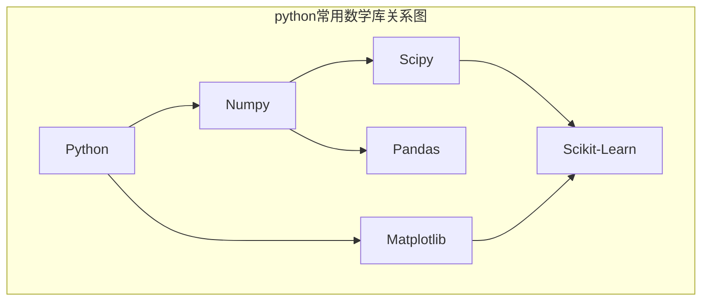

**所用语言**:python(主)或matlab

```mermaid
graph TD
	subgraph python常用数学库关系图
	Python-->Numpy
	Python-->Matplotlib
	Numpy-->Pandas
	Numpy-->Scipy
	Scipy-->Scikit-Learn
	Matplotlib-->Scikit-Learn
	end
```
<AutoCatalog />
